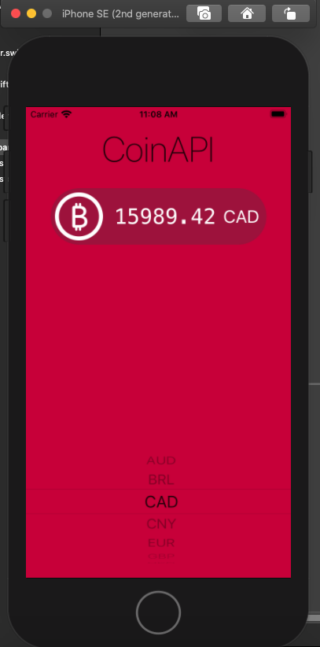

#  iOS-App powered by CoinAPI

In this piece of the experiment with Networking and APIs in iOS i've decided to utilize the CoinAPI to get the rate of Bitcoin in various currencies. In the process, i've explored URLSession, making HTTP requests. Also, parsing JSON with native Encodable and Decodable protocols. Further, the delegate design pattern is also applied.

